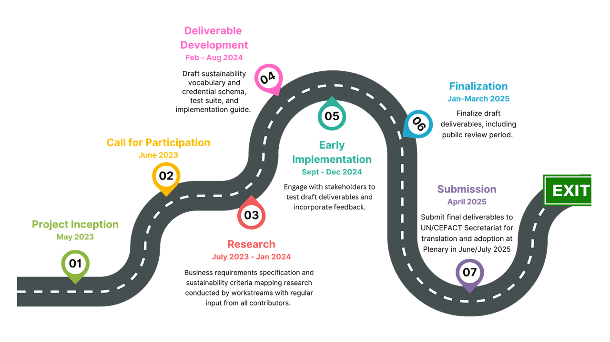

import Disclaimer from '../\_disclaimer.mdx';

<Disclaimer />

## Countering Greenwashing through Transparency at Scale

Greenwashing is a term used to describe a false, misleading, or untrue action or set of claims made by an organization about the positive impact that a company, product or service has on the environment or on social welfare.

The evidence from multiple research activities is that greenwashing is already endemic with around 60% of claims proven to be false or misleading. There is, however, room for optimism because around 70% of consumers expect higher integrity behaviour and are willing to pay for it. There are two plausible pathways ahead of us.

 

To win the race to the top, fake claims need to be hard to make. The best way to achieve this is to make supply chains traceable and transparent so that unsustainable practices have nowhere to hide. But, to have any impact, the traceability and transparency measures must be implemented at scale. The world's supply chains must move beyond low-volume traceability pilots and "walled garden" proprietary solutions to the point where verifiable traceability and transparency information are available to motivate consumers for the majority of products on the market.

## Measures of Success

Scalability and associated evidence of high-volume production implementation is this project's key measure of success. We will be able to claim a moderate level of success for the pilot implementation phase if we have evidence that:

* at least 50 different CRM supply chain actors;
* using at least 5 different software platforms;
* across at least 5 different value chains;
* spanning at least 5 different countries;
* can reveal transparent supply chain evidence for at least 10,000 consignments.

This is still a tiny fraction of global trade volumes but is likely sufficient to prove the framework is scalable. 

## Reference Material​

* [UN White paper on verifiable credentials for cross border trade](https://uncefact.github.io/project-crm/assets/files/WhitePaperVerifiableCredentials-d63cc70d2a6b4cee80999b5e0b242080.pdf) - this technology is the most likely solution for highly scalable sustainability data exchange.
* [All Members Year-End UNTP-CRM Presentation](https://drive.google.com/file/d/1vEUI12fLFdgotVWnglcSYOrWxkqamDeD/view?usp=sharing)

## Work Plan and Activity Schedules​

The following roadmap depicts the project’s key activities, deliverables, and timelines. 

