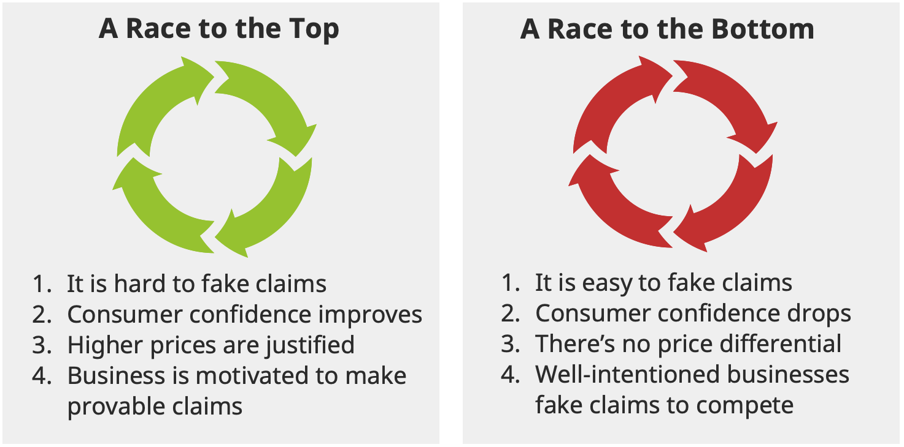

# About this project

## Critical raw materials sustainability & resilience

In line with the [UN sustainability goals](https://sdgs.un.org/goals) and building on the success of the [UNECE Textile & Leather traceability project](https://unece.org/trade/traceability-sustainable-garment-and-footwear), this project seeks to develop a traceability and sustainability framework for critical raw materials (CRM). This project supports the UN focus on extractive industries and builds on the UN/CEFACT role & capabilities to deliver digital standards for sustainable supply chains.

The purpose of [this project](https://uncefact.unece.org/display/uncefactpublic/Critical+Minerals+Traceability+and+Sustainability) is to combat greenwashing and uplift verifiable critical raw materials supply chain sustainability and resilience.

* **Sustainable** supply chains are designed to minimize environmental impacts and maximize human welfare.
* **Resilient** supply chains are designed to avoid risky dependencies and can withstand disruptions. 

Both goals are met through digitizing traceability and transparency **at scale**. In order to scale from pilots to global scale production volumes, this project focuses on two key challenges

* **Interoperability:** There are different supply chain traceability platforms on the market. Since they will not lead the world’s supply chains, end-to-end traceability will depend on standards-based interoperability **between** platforms. This project will define interoperability standards and implementation test services in which supply chain actors can pick any compliant platform. 
* **Core Vocabulary:** There are already hundreds of ESG standards or related criteria as well as several emerging regulatory criteria specific to geographic or industrial sectors. This complexity imposes challenges for supply chain actors who must understand how their domestic sustainability measures map to the standards or regulatory criteria of their export markets. This project will focus on the **mapping** of current ESG standards by developing a core vocabulary of criteria and a legal framework for mutual recognition.

## Greenwashing

Greenwashing is a term used to describe a false, misleading, or untrue action or set of claims made by an organization about the positive impact that a company, product or service has on the environment or on social welfare.

The evidence from multiple research activities is that greenwashing is already endemic with around 60% of claims being proven to be false or misleading. But there is room for optimism because around 70% of consumers expect higher integrity behaviour and are willing to pay for it. There are two plausible pathways ahead of us.

To win the race to the top, fake claims need to be hard to make. The best way to achieve that is to make supply chains traceable and transparent **so that unsustainable practices have nowhere to hide**. But, to have any impact, the traceability and transparency measures must be implemented at scale. The world's supply chains must move beyond low-volume traceability pilots and "walled garden" proprietary solutions to the point where verifiable traceability and transparency information are available to motivate consumers for the majority of products on the market.  

Therefore, scalability and associated evidence of high-volume production implementation is this project's key measure of success. We will be able to claim a moderate **level of success** for the pilot implementation phase if we have evidence that:

* at least 50 different CRM supply chain actors
* using at least 5 different software platforms
* across at least 5 different value chains
* spanning at least 5 different countries
* can reveal transparent supply chain evidence for at least 10,000 consignments. 

The best way to achieve that is to make supply chains traceable and transparent so that unsustainable practices have nowhere to hide. But, to have any impact, traceability and transparency measures must be implemented at scale. The world’s supply chains must move beyond low-volume traceability pilots and "walled garden" proprietary solutions to the point where verifiable traceability and transparency information are available to motivate consumers for most products on the market.

This is still a tiny fraction of actual global trade volumes but is probably sufficient to prove that the framework is scalable. 

## Participation

This project will be of interest to primary producers, manufacturers, regulators, ESG standards authorities, certifiers, and ESG/traceability software solution vendors.

Under the [UN/CEFACT Open Development Process (ODP)](https://unece.org/DAM/cefact/cf_plenary/2016_plenary/CF_2016_017E_ODP.pdf), participation in this project is open to all. There are three types of participation:

* **Observers:** Anyone who is interested in following the activities and outcomes from this project but will not be actively contributing to the standards development work nor participating in pilot implementations. Observers may join the conversation on our Slack channel and/or subscribe to our monthly project newsletter.
* **Contributors** Anyone who is able to provide the skills and commitment to contribute to standards development. Participants in this category should either have deep business domain knowledge in CRM supply chain sustainability or technical skills in decentralized architectures and data modelling. As a contributor, you must conform to  [UN/CEFACT IPR policy](https://unece.org/DAM/cefact/cf_plenary/plenary12/ECE_TRADE_C_CEFACT_2010_20_Rev2E_UpdatedIPRpolicy.pdf) and must [join UN/CEFACT](https://uncefact.unece.org/display/uncefactpublic/UNCEFACT+Expert+Registration) as a registered expert. Note that this will require the approval of your country's head of delegation.
* **Implementers**: Any CRM supply chain actor (e.g. producer, manufacturer, certifier, software vendor) that wishes to participate in early pilots and/or certify their software against the standards defined by this project.

Please [email the project lead](mailto:nancy.norris@gov.bc.ca) if you wish to participate as a contributor or implementer.

## Reference material

* [UN White paper on verifiable credentials for cross border trade](../files/WhitePaperVerifiableCredentials.pdf) - this technology is the most likely solution for highly scalable sustainability data exchange.
* [All Members Year-End CRM Project Presentation](https://drive.google.com/file/d/1vEUI12fLFdgotVWnglcSYOrWxkqamDeD/view?usp=sharing)

