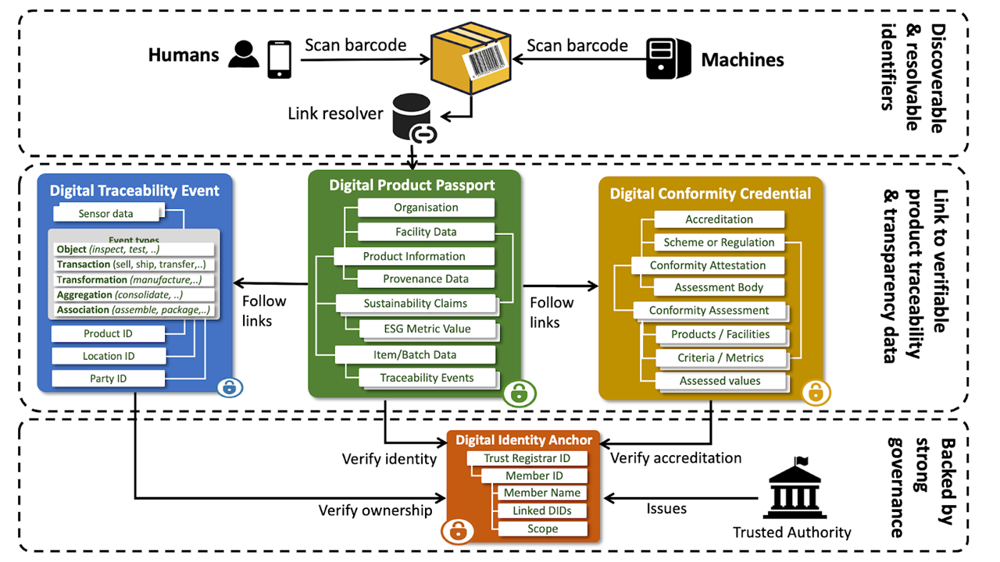

import Disclaimer from '../\_disclaimer.mdx';

<Disclaimer />

In line with the [United Nations (UN) Sustainable Development Goals](https://sdgs.un.org/goals) (SDGs) and building on the success of the [UNECE Textile & Leather traceability project](https://unece.org/trade/traceability-sustainable-garment-and-footwear), [this project](https://uncefact.unece.org/display/uncefactpublic/Critical+Minerals+Traceability+and+Sustainability) **seeks to empower the Critical Raw Material (CRM) industry with practical, low cost tools for digital data exchange to achieve product differentiation, maximize the value of existing permitting and ESG compliance efforts, counter greenwashing, and support a more sustainable global economy.** This project supports the UN focus on extractive industries and leverages the [UN Center for Trade Facilitation and Electronic Business'](https://unece.org/trade/uncefact) (UN/CEFACT) role and capabilities to deliver digital standards for sustainable supply chains.

The project is developing a standardized methodology for interoperable supply chain data exchange by adapting the [United Nations Transparency Protocol (UNTP)](https://uncefact.github.io/spec-untp/docs/extensions/ExtensionsMethodology) to the specific needs of the CRM industry. The draft standard, called UNTP-CRM, is based on a simple pattern of data sharing, in which holders of up-and midstream CRM supply chain data (miners, smelters, processors, manufacturers etc.) can publish and link information about shipments of their goods in a manner that can be discovered and understood by interested parties, such as customers, border authorities, and regulators. [Trust anchors](https://uncefact.github.io/project-crm/docs/register/Anchors), such as performance certifiers and governments, can publish related sustainability certificates and permits that can be digitally linked to the claims being made about shipments of goods, increasing the legitimacy of those claims.  

The use of advanced digital technology, called verifiable credentials, ensures that all data is verifiable, protected, and accessible only to parties with permission granted by the original data owner. Using the [Technical Specification](https://uncefact.github.io/project-crm/docs/specification/) and [Guidance for Implementers](https://uncefact.github.io/project-crm/docs/guidance/), organizations can build UNTP-CRM functionality into their existing Enterprise Resource Planning (ERP) systems, or partner with UNTP-CRM compliant traceability solutions. At this stage of the project, we are looking for early implementers to test the draft methodology, and provide feedback and input for its refinement. [Please indicate your interest in early implementation here.](https://docs.google.com/forms/d/e/1FAIpQLSecdZ4izTK-K64NA53grzmjIEJ26Y-yLjpm-2G_28ICzVk0zQ/viewform)

The diagram below shows how UNTP-CRM is implemented at the product-level. For example, a mine site produces a shipment of liquified copper, and issues a digital product passport (DPP) that includes various claims about the shipment, such as product origin and sustainability indicators. The mine site also issues a digital traceability event credential that is linked to the shipment DPP and attests to the stage of the supply chain, in this case, raw material extraction and primary processing. This DPP can be digitally linked to digital conformity credentials that are issued by trusted authorities about a shipment or mine site. This could be a government issued mining permit, or a performance certificate issued by an accredited assurance provider or mining industry organization.  

The diagram below provides the entire value chain perspective. Each actor along the supply chain issues a DPP for the product they produce along with an associated traceability event credential indicating the processing stage. Product DPPs are digitally linked to those of the previous stage, as well as digital conformity credentials which add credibility to the claims made about the individual product. For the downstream consumer or border authority, undertaking supply chain due diligence is like pulling on the end of a string of linked, verifiable data.

 

## What we are NOT doing:

* We are not creating another CRM traceability platform nor are we planning to pick any winners. We are creating a standard that CRM traceability solution providers can adopt to facilitate interoperability with other platforms.
* We are not defining new sustainability standards or permitting processes. We aim to enable the recognition of current sustainability certifications and regulatory permits, and increase the value for miners of the permits and certifications they already hold. We aim to identify a core set of criteria which can be included by supply chain actors when making claims about their products, and enable a standard for digitally linking these claims to existing permits and sustainability certifications.

