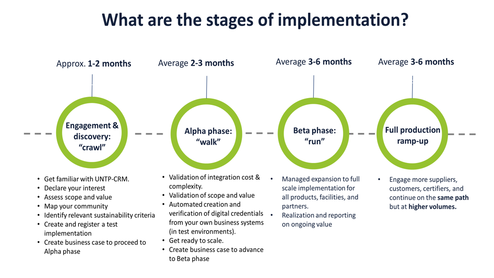

import Disclaimer from '../\_disclaimer.mdx';

<Disclaimer />

## First Stage: Early Implementation (“crawl”)

### **Familiarize Yourself with UNTP-CRM’s Core Concepts**

We suggest you familiarize yourself with the core concepts listed in the [UNTP Architecture](https://uncefact.github.io/spec-untp/docs/specification/), including how they are applied in the [CRM context](https://uncefact.github.io/project-crm/docs/specification/Architecture). We also suggest you read the [Implementers section](https://uncefact.github.io/project-crm/docs/register/) of this site to understand the various roles, and consider which role your organization would play as an UNTP-CRM implementer.

### **Declare your Interest**

State your interest in participation to the project team using [this form](https://uncefact.github.io/project-crm/docs/about/).  We will follow up with you to assess your suitability for early implementation, and assist you to define your scope and value proposition. 

### **Define Your Scope and Value Proposition**

Based on our interactions with potential early implementers, we’ve observed a typical engagement pattern, in which an interested party within an organization reaches out to the project team regarding participation as an implementer, and requires additional information about **1) resources required and 2) value of participation**. Armed with this information, they can advocate for participation to other relevant decision makers within their organization, such as their sustainability, IT and supply chain leads. 

With this in mind, we have developed a [**value proposition template**](https://docs.google.com/presentation/d/1CXkunB9L5Nr-Xw-4tQ8rJOYNMOZOObF7/edit?usp=sharing&ouid=102588425343518355761&rtpof=true&sd=true) to assist potential implementers in articulating the benefits of participation and resources required for their organization. As you develop your value proposition, we suggest you map your community, using the recommendations below, as the value of early implementation will increase when multiple parties can share verified data interoperability. 

We also recommend that you start to develop an implementation plan and business case for your “Walk”/Alpha phase implementation. Based on our research into relevant funding programs, such as CIRPASS 2, they are looking for consortiums that are post-pilot, implementation-ready. Consider activating your community/ supply chain as you undertake early implementation to realize full value and prepare for external funding applications. 

### **Map and Activate Your Community**

As the UNTP-CRM defines a scalable methodology for data sharing among CRM industry actors along supply chains, the value of implementation is only realized through adoption by multiple actors:

* For **supply chain actors**, it is beneficial to identify who you buy and sell to, and assess whether they would like to join you as an early implementer, to increase the value of your participation. See the [UNTP Community Activation page](https://uncefact.github.io/spec-untp/docs/business-case/CommunityActivationProgram) for suggested approaches. The UNTP-CRM team can assist with connecting you to other CRM industry actors who have expressed interest in early implementation and could benefit from a collaborative, multi-stakeholder pilot.
* For **regulators**, performance certifiers, and assurance providers, can increase the value of certifications, permits, and audit reports by enabling them to be digitally linked to product-level claims. By activating the organizations you certify, regulate and audit to become UNTP-CRM implementers, you can add a new dimension of utility to your outputs.
* For **software providers**, sharing digital credentials about the material origin and ESG data of CRM shipments is going to be powered by the digital tools. Technology platforms that are compatible with other platforms offer higher value to customers who need to exchange credentials internationally. Activating your community and customers to become UNTP-CRM compliant increases the value of the service you provide.

You can find advice and best practices on the [UNTP community activation page](https://uncefact.github.io/spec-untp/docs/business-case/CommunityActivationProgram) to help identify and engage other actors in your ecosystem including your upstream suppliers, downstream customers, conformity assessment bodies, and traceability software vendors. As early implementers progress to full adoption, they can provide feedback to the CRM project team to develop and refine CRM-specific community activation guidance and tools.

### **Identify the Sustainability Information Requested by Your Buyers and Sellers** 

For supply chain actors, such as mining companies, smelters, processors and manufacturers, we suggest you identify the sustainability information that you are being asked for by your buyers and sellers. This will inform the design of the digital product passport you will publish for shipments of your goods. 

As part of the implementation testing phase, the Project Team has created [this short survey](https://docs.google.com/forms/d/1E1-kRuP3FDkxhamXbTRixhWA5xifyvqKxkzgSaYOjhE/prefill) (15 minutes) which will ask participants to select from a set of ESG criteria, indicating the information they are most often asked to provide to buyers and sellers. The Project Team will follow up with willing respondents for a 30-60 minute information interview. Survey and interview results will assist in the refinement of a finalized sustainability criteria list, which can be used by implementers to design their digital product passports.

### **Create and Register Your Test Implementation**

* Manually create trial digital credentials and exchange with a small number of trading partners.
* If you have an IT department, ask them to review the Technical Specification, Reference Implementation and Conformity Testing  sections of this website. They can determine whether they have the in-house capability and capacity to undertake and test a UNTP-CRM test implementation. The Project Team would be happy to meet with you and discuss this.
* Consider working with a Traceability Solution provider that is either UNTP-compliant or is working to become UNTP-compliant. The Project Team can facilitate introductions as requested. 

### **Create a Business Case to Proceed to Alpha Phase**

## Second Stage: Implementation (“walk”)

* Undertake Community Activation Plan and Designate Community Leader.
* Validate integration cost & complexity.
* Validate of scope and value.
* Automate the creation and verification of digital credentials from your own business systems (in test environments).
* Engage with the activated community to achieve consistency in implementation across a commodity and/or geographic sector.
* Get ready to scale.
* Create a business case to advance to Beta phase.

## Third Stage: Implementation

* Manage expansion to full scale implementation for all products, facilities, and partners.
* Develop a roadmap for long term adoption, that includes ongoing value assessment
