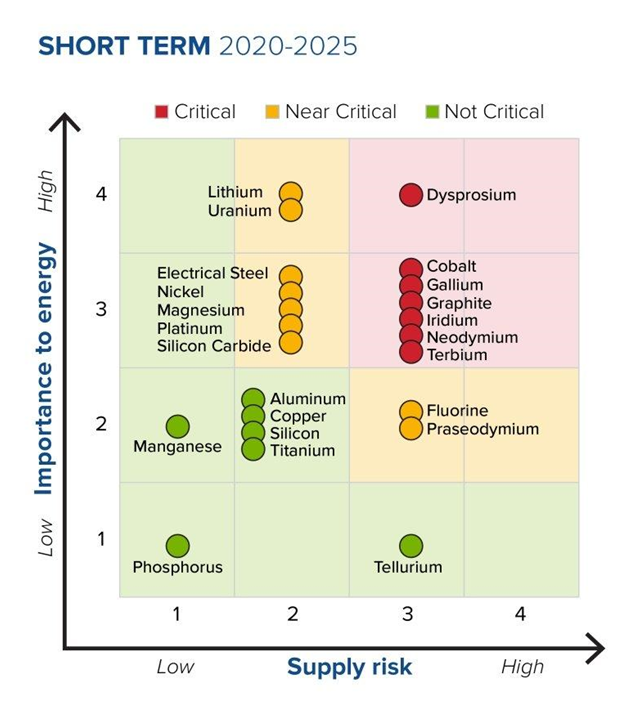
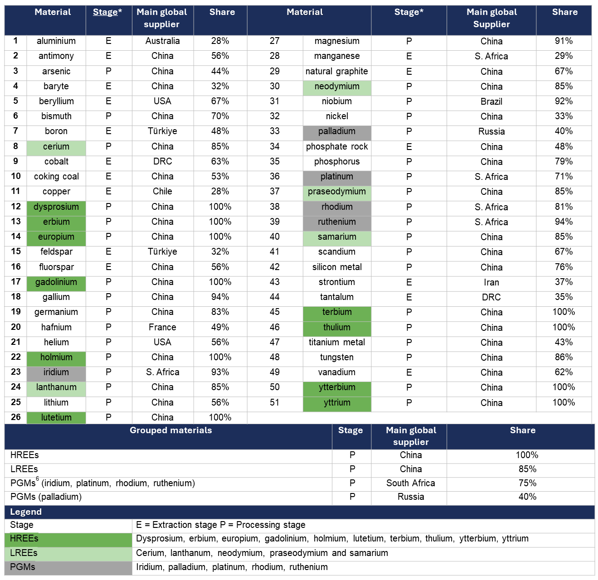
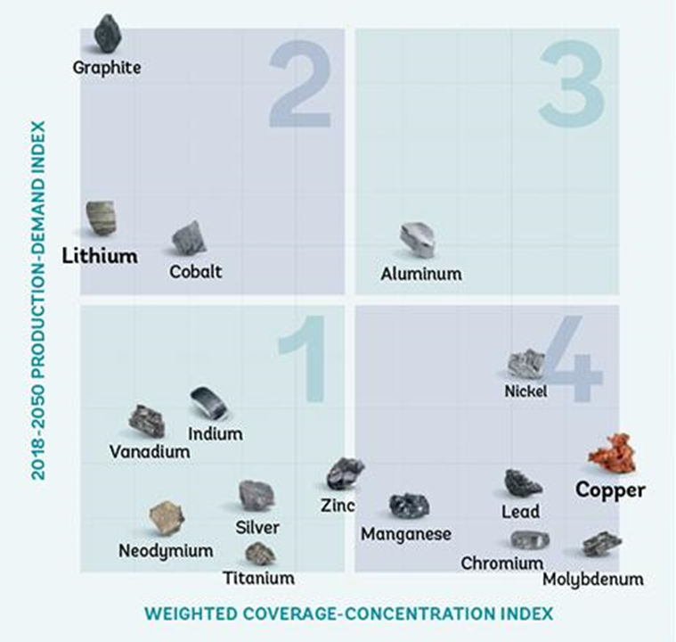

import Disclaimer from '../\_disclaimer.mdx';

<Disclaimer />

Critical raw materials (CRM) are metals, non-metals (minerals) and other substances (e.g. Helium) that are considered essential for renewable energy transition, digital economy and national security and whose supply may be at risk due to geological scarcity, geopolitical issues, trade policy or other factors. 

CRM classifications might vary between countries, different sections of governments, and different industries (eg. Figure 1. The US DoE Matrix). However, the criticality assignment is always defined by potential supply risk, economic importance (demand), and ESG impact of CRM substances.

The CRM classification from a supply-demand perspective can inform upstream actors (mining operators) to manage risks and realize opportunities. Mining operators will thereby benefit from the ability to extract the value of the certification and regulatory processes they are currently undergoing, and gain competitive advantage by proving their materials have the best sustainability characteristics.  

[Figure 1. Short-term (2020–2025) criticality matrix Supply vs Demand (U.S. Department of Energy, Critical Materials Assessment 2023](https://www.energy.gov/cmm/what-are-critical-materials-and-critical-minerals )

## Supply Classification of CRM

The two main identifying aspects for supply risk classification of Critical Raw Materials are the stages of the CRM supply chain and CRM abundance or distribution at the given stage.

The risk stage often implies a bottleneck vulnerability point in the value chain where the supply risk is highest (e.g., concentration, disruptions, market volatility etc.) to influence the CRM abundance or distributions. From the supply perspective, vulnerabilities often occur at **two stages**: the **extraction** stage - the production of ores and concentrates; and the **processing** stage - the refining, chemical and metallurgical modification of raw materials (Grohol & Veeh, 2023, https://op.europa.eu/s/zPBi). 

The notable risks at these stages that may impact CRM Abundance and Distribution are:
* **Concentration:** Many critical minerals are geographically concentrated in a few countries, and processing and refining of critical minerals often take place in a few specialized facilities. It may also arise from an overreliance on single suppliers or a small number of suppliers, especially for imported goods.
* **Disruption:** Disruption can be caused by trade restrictions and challenges that bottleneck at a vulnerability point arising from various factors, such as political instabilities, natural disasters, logistical challenges, etc.
* **Market Volatility:** The prices of critical minerals can be highly volatile due to shifts in demand, speculative trading, or sudden changes in supply (e.g., mine closures or discoveries). Price volatility can make it difficult for companies to plan and budget effectively to provide a steady supply.
* **Technological Risks:** Many CRMs are by-products and have varying main-product metal companionability and restricted recovery streams. Additionally, the technological capability for a specific resource recovery or processing might be unavailable or inefficient.
* **Resource Capacity, Reserves and Depletion:** Many critical minerals are non-renewable, and the richest deposits may be exhausted over time. A lack of confidence in the existence of available reserves is indicated by geological knowledge and economic feasibility data. As resources become scarcer, mining companies may need to explore less accessible or lower-grade deposits, which can be more expensive and environmentally damaging to exploit.
* **Regulatory Risks:** Increasing pressure from investors, consumers, and governments for sustainable and ethical sourcing practices can pose challenges for companies that rely on critical minerals. Non-compliance with ESG standards can lead to reputational damage, legal liabilities, and loss of market access.
* **Economic Risks:** Developing new mining projects or operating existing ones requires high capital and operational costs vulnerable to economic downturns or fluctuations in commodity prices.

Managing these risks requires a comprehensive and proactive approach by the main economic operators at the CRM supply-**Mining operators**. These actors are the start of the value chain, and for those  that generate origin claims and invest in ESG activities, it will be important to provably demonstrate their activities. This will better enable access to markets and capital that value investments in ESG outcomes.

An example of the CRM supply classification based on the supply stage and resource availability risk- Import supplier concentration into the EU (Study on the Critical Raw Materials for the EU 2023, Grohol & Veeh, 2023, https://op.europa.eu/s/zPBi)

 

## Demand Classification of CRM

On the contrary, the usage and application of CRM can be the basis of demand classification for a variety of minerals and metals. There is increasing demand for CRMs to expand wind, solar, geothermal power, and energy storage to achieve a future where global warming is limited to below 2°C. However, the precise quantity of each mineral will vary based on the specifics of the energy transition. In other words, the demand for any particular mineral will depend on its usage across various renewable energy technologies.

While some minerals, like copper and molybdenum, will be used in a range of technologies, others, such as graphite and lithium, may be needed for just one technology: battery storage. This means that any changes in clean energy technology deployments could have significant consequences on demand for certain minerals.

The demand risk matrix developed by the [World Bank Group] (https://www.worldbank.org/en/news/feature/2020/05/08/redefining-critical-minerals-essential-for-a-clean-energy-future) categorizes CRM by its demand impact on a specific technology of a low-carbon future and the need for a variety of technologies. 

 

CRM Categories are:

* **High-impact and Cross-Cutting CRM (Category 3 in Figure above)** are used in a wide range of technologies and required to meet projected demand in a low-carbon world. **One example is aluminium:** It is used widely for both energy generation and storage technologies, with roughly 103 million tons of aluminium needed to supply 87% of solar PV and a range of other clean energy technologies to achieve a below 2°C future.
* **Cross-Cutting CRM (Category 4)** is essential across a wide variety of technologies. **One example is copper:** it is used across all 10 energy technologies – so regardless of the low-carbon “pathway”, it is likely to be relevant in 2050. It also means that the clean energy transition will depend very much on the availability of copper itself.
* **High-impact CRM  (Category 2)** are only featured in a small number of technologies, but their future demand is significantly greater than today. **One example is lithium**, which will only be used in energy storage, but must ramp up its production by 488% to meet demand. Cobalt and graphite fall in the same category.
* **Medium-Impact CRM (Category 1)**, such as **neodymium and silver**,  are needed for a small range of energy technologies, and their demand is not expected to grow significantly between now and 2050. However, neodymium is a key ingredient for offshore wind turbines. 

Mining operators have a real opportunity to benefit from the rise in demand for critical minerals with targeted plans for a range of demand categories and paying close attention to how the nature of the clean energy transition will shape future demand.  

## ESG Impact of CRM 

* **Sustainability Requirements as Supply Chain Risk:** Increasing pressure from investors, consumers, and governments for sustainable and ethical sourcing practices can pose challenges for companies that rely on critical minerals. Non-compliance with ESG standards can lead to reputational damage, legal liabilities, and loss of market access.
* **Refiners & manufacturers:** The key challenges we will be focusing on for refiners and manufacturers will be how they demonstrate the provenance claims and ESG features of the inputs to the products that they produce and how the credentials about those inputs are 'attached' to the goods they are producing.
* **ESG standards & certifiers:** The value of the standard and/or certifications are tied directly to the value the market places of having trustable proof that the goods or services meet the standard. A verifiable certificate provides this proof. The certification and accreditation community creates an important trust anchor.
