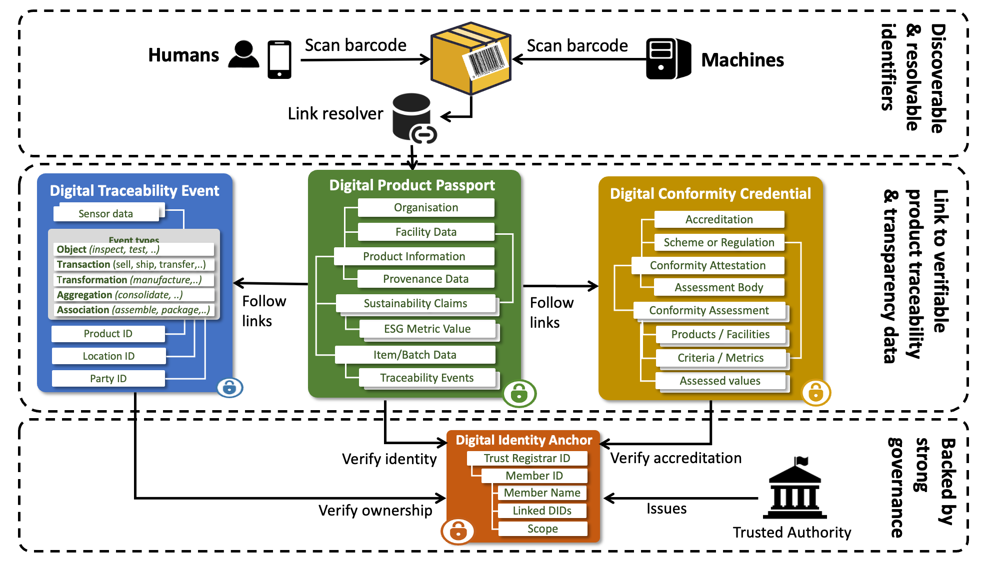
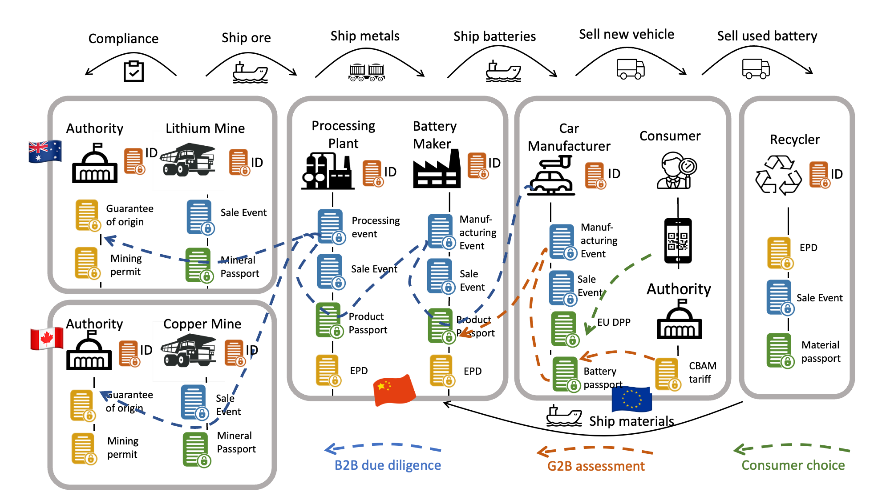

import Disclaimer from '../\_disclaimer.mdx';

<Disclaimer />

## Overview

The architecture is the blueprint for all the components of the specification and how they work together. It defines the **design principles** which underpin the AATP and shows the components working together from the perspective of a **single actor** and across the **entire value-chain**. The AATP is a fundamentally **decentralised architecture** with no central store of data.

## Principles

1. In alignment with the UNTP extension methodology, UNTP-CRM aligns as closely as possible to UNTP and clearly identifies and explains any adaptations required for use by the CRM industry.
2. Simple and implementable always wins over expansive & complex.
3. Open and free is a fundamental requirement.
4. Collaborative development encourages buy-in.
5. Decentralized models will always be more scalable than centralized ones.
6. Independently verifiable claims are more credible.
7. Learn and leverage existing ecosystems, methodologies, standards and approaches.

# Design Challenges​

Implementing end-to-end supply chain traceability at scale faces a number of challenges.

Challenge | Our approach 
-- | --
A plethora of platforms exist already | We must focus on interoperability between systems, not picking winners. We’ll also provide guidance on how existing systems can extend their capability to support interoperability. 
Technology maturity is variable | We must accommodate small businesses and developing nations and allow a gradual transition from paper processes.
Most traceability pilots have not scaled to production volumes | We must design simple and scalable solutions that can be implemented at scale
Supply chain actors will not expose sensitive data | We must allow stakeholders to protect sensitive commercial information whilst revealing ESG info.
ESG claims have different levels of trust | We must provide sufficient evidence to trust the claims.
Greenwashing fraud is endemic | We need to explicitly identify greenwashing fraud vectors and how to solve them – including product substation, mass balance, etc. In particular, in CRM, suppliers have taken the approach of inserting a middleman and obscuring the traceability to the source. A goal of this approach must be the traceability of claims back to the point of extraction, as required by the OECD due diligence handbook.
Cost | The solution must be cheap enough that there remains a plentiful margin incentive for producers and manufacturers to change behaviour.

## Components

See the [UNTP Technical Specification](https://uncefact.github.io/spec-untp/docs/specification/), for purpose and description of the following components:

* Verifiable Credentials Profile (VCP)
* Digital Product Passport (DPP)
* Digital Conformity Credential (DCC)
* Digital Traceability Events (DTE)
* Digital Identity Anchor (DIA)
* Identity Resolver (IDR)
* Decentralised Access Control (DAC)
* Sustainability Vocabulary Catalog (SVC)

## Each Actor

## Entire Value Chain

* [Technical Specification](https://uncefact.github.io/project-crm/docs/specification/)
* Material Passports
